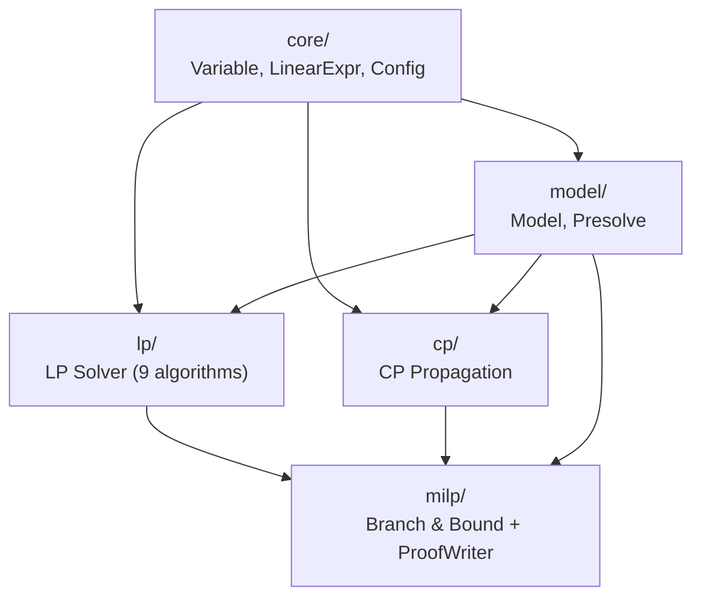
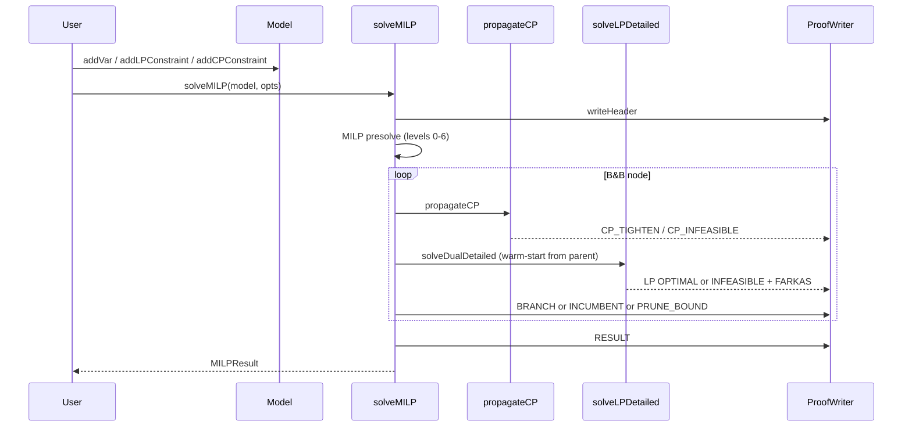

# Baguette - Architecture Overview

Baguette is a Mixed-Integer Linear Programming (MILP) solver with machine-verifiable proof logging. Given an optimization problem with continuous and integer variables, it finds the optimal solution and produces a certificate that an independent verifier can check without re-running the solver.

## Module dependency graph

Dependencies flow strictly downward. The `milp/` module is the only entry point visible to the user.

## Modules

| Module | File | Role |
|--------|------|------|
| [core](core.md) | `src/core/` | Primitive types: `Variable`, `LinearExpr`, global tolerances |
| [model](model.md) | `src/model/` | Problem construction API, hot/cold data layout, presolve |
| [lp](lp.md) | `src/lp/` | LP relaxation solver, 9 algorithms, Farkas certificates, warm-start |
| [cp](cp.md) | `src/cp/` | Constraint propagation: AllDiff, Cumulative, user-defined constraints |
| [milp](milp.md) | `src/milp/` | Branch & Bound loop, cut generation, execution trace |
| [proof system](proof_system.md) | `src/milp/ProofWriter.*` | Machine-verifiable B&B certificate format |

## Solving pipeline

## For researchers: where to start

1. **Understand the data model**: read [core.md](core.md) and [model.md](model.md) to understand how problems are represented.
2. **Understand the B&B loop**: read [milp.md](milp.md), which contains the full flow diagram and explains node selection, branching, and cut generation.
3. **Read a proof trace**: enable proof logging with `BBOptions::proofStream = &std::cout`, run a small instance, and cross-reference each token with [proof_system.md](proof_system.md).
4. **Verify a certificate**: the verification procedure in [proof_system.md](proof_system.md) is independent - it requires only the model and the proof file, not the solver.
5. **Understand the LP certificates**: read [lp.md](lp.md) for the Farkas certificate forms and [proof_system.md](proof_system.md) for how they appear in the trace.
6. **Understand CP certificates**: read [cp.md](cp.md) for the propagation algorithms and [proof_system.md](proof_system.md) for the `CPFailureWitness` verification.

## Key design decisions

**Hot/cold separation** ([model.md](model.md)): bounds and objective coefficients are kept in dense contiguous arrays (`ModelHot`) accessed by the LP solver on every iteration. Labels and types are kept separate (`ModelCold`) and never touched during solving.

**Warm-start via sfCache** ([lp.md](lp.md)): child B&B nodes reuse the parent's standard form via a `shared_ptr` copy (O(1)) and only recompute the RHS vector for the new bounds. This avoids O(m*n) standard-form reconstruction at every node.

**Global cuts** ([milp.md](milp.md)): GMI and MIR cuts are added permanently to the working model. All subsequent nodes benefit, but cut addition sacrifices warm-start reuse for queued siblings (detected via `sfCache` dimension mismatch, automatic cold fallback).

**Two-tier CP dispatch** ([cp.md](cp.md)): built-in constraints use `std::variant` (zero-overhead dispatch), user-defined constraints use virtual dispatch. The distinction matters because built-ins are called O(N * K) times per B&B tree.

**Proof completeness** ([proof_system.md](proof_system.md)): nodes whose LP solver hit its iteration limit or had a numerical failure are logged as `UNVERIFIED` rather than silently discarded. This makes incomplete proofs diagnosable.
