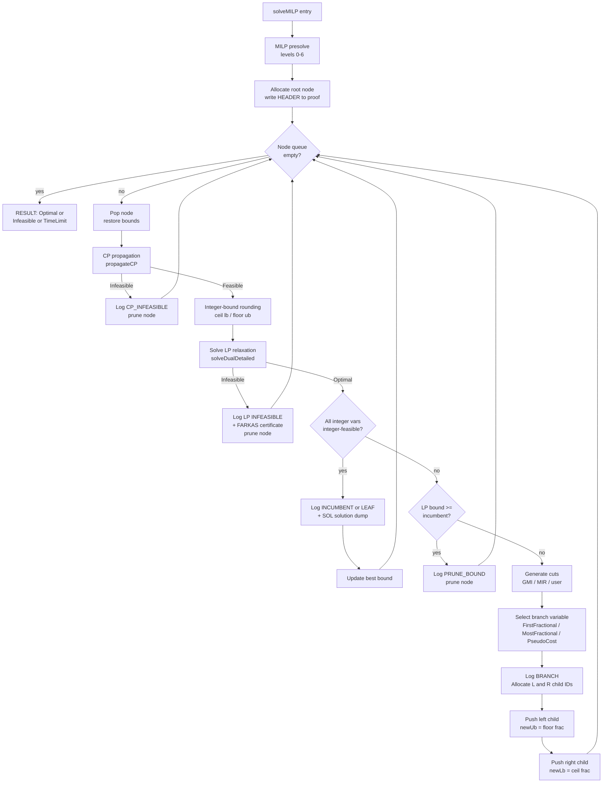

# MILP / Branch & Bound

The `milp/` module solves Mixed-Integer Linear Programs via Branch & Bound (B&B) with LP relaxation at each node.

## Entry point

```cpp
MILPResult solveMILP(const Model& model,
                     const BBOptions& opts = {},
                     SolverClock::time_point startTime = SolverClock::now());
```

The function works on an internal copy of the model; the caller's model is never mutated. If the model has no integer or binary variables, the LP relaxation is solved directly and returned as a single-node result.

## B&B flow



## Presolve levels

Applied once before the B&B root. Levels are cumulative:

| Level | Technique |
|-------|-----------|
| 0 | None |
| 1 | LP bound-tightening + integrality rounding + PR1 (default) |
| 2 | + CP fixpoint propagation at root |
| 3 | + Weak probing (binary fix + propagation + bounds intersection) |
| 4 | + Root LP infeasibility detection |
| 5 | + Binary implication rows injected from probing |
| 6 | + Strong probing (LP solve per binary fix) |

## Node selection

| Strategy | Behaviour | Best for |
|----------|-----------|---------|
| `BestBound` | Pop node with best LP bound | Tight optimality proof, more nodes |
| `DepthFirst` | Stack discipline (DFS) | Fast incumbent, better warm-start reuse |
| `HybridPlunge` | DFS until first incumbent, then BestBound | Default: combines both advantages |

`HybridPlunge` caps the DFS phase at `maxPlungeNodes = 200` to abort unproductive plunges on degenerate problems.

## Branching strategies

| Strategy | Selection | Fallback |
|----------|-----------|---------|
| `FirstFractional` | First fractional integer variable by ID, O(n) | none |
| `MostFractional` | Variable with frac closest to 0.5, O(n) | none |
| `PseudoCost` | Best product score from branching history | `MostFractional` for unknown vars |

Default: `MostFractional`.

## Cut generation

Cuts are **globally valid** and added permanently to the working model copy. All subsequent nodes benefit. This is the global-cut strategy.

| Type | Source | Trigger |
|------|--------|---------|
| GMI | Gomory Mixed-Integer from fractional tableau rows | `enableCuts = true` |
| MIR | Mixed-Integer Rounding from LessEq constraints | `enableMIR = true` |
| CMIR | Complemented MIR from GreaterEq constraints | `enableMIR = true` |
| User | `CutGenerator` callback | `cutGenerators` non-empty |

After a cut is added, the local LP is re-solved from a cold start (the pre-cut basis is structurally incompatible). Queued sibling nodes with stale `BasisRecord`s detect the `sfCache` dimension mismatch and also fall back to a cold solve.

Cut budgets: `maxCutsPerNode = 10`, `maxTotalCuts = 500` (shared across GMI and MIR). `maxRootCuts` allows a larger budget at the root specifically.

## Warm-start across nodes

Each solved node produces a `BasisRecord` that includes `sfCache` (a `shared_ptr` to the full standard form). The child node receives this via `LPOptions::warmBasis`. The dual simplex reuses `sfCache` and only recomputes the RHS vector `b` for the new bounds - O(1) instead of O(m*n).

Bound changes are tracked via `ChangesNode`, a persistent linked list that records which variables were modified relative to the parent. On backtrack, only the dirty variables are restored, not the full model.

## CP integration

If the model has CP constraints, `propagateCP` is called at every node before the LP solve. Bounds tightened by CP are tracked in `dirtyVars` and reset automatically by the next `restoreBounds`. If CP reports `Infeasible`, the node is pruned without any LP solve.

## Execution trace

When `BBOptions::proofStream` is non-null, every node event is written to the stream in the Baguette log-proof format. The trace is machine-verifiable: a verifier can reconstruct the entire B&B tree from the proof without re-running the solver.

See [proof_system.md](proof_system.md) for the full format specification.

## Design assumptions

- The B&B loop is single-threaded. `ProofWriter` is designed for future multi-threading (mutex + atomic ID allocation) but the solver itself is not yet parallelised.
- MIP gap tolerances: `mipGapAbs = 1e-6`, `mipGapRel = 0.0` (exact solver by default). Increasing `mipGapRel` trades proof exactness for speed on large-objective problems.
- The `maxNodes = 1'000'000` and `timeLimitS = 3600.0` defaults are soft caps. The B&B terminates with `SubOptimal` status if either is hit before optimality is proved.
- User `CutGenerator` callbacks must return globally valid cuts. Locally valid cuts corrupt the search; the solver does not validate them.
